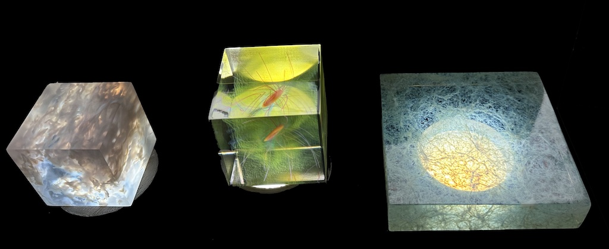
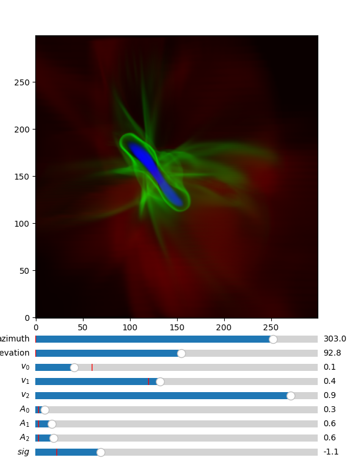

# 3D Printing Astrophysics Data

Work in progress.

This package contains data, code, and notebooks to generate image stacks that can be 3D printed on Polyjet printers. See the [documentation](https://birnstiel.github.io/astro3D) for details.

## Volume rendering

The package also includes some ability for volume rendering and line integral convolution plots for visualization.

To use the volume rendering, try out this:

    volrender turbulentbox.npy

or this:

    volrender -f rho pluto_data.npz

This should produce a volume rendering of the given data like this:

